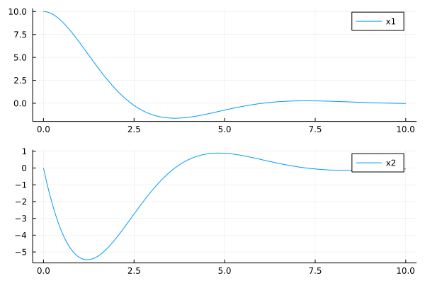

# FSimBase
[FSimBase.jl](https://github.com/JinraeKim/FSimBase.jl) is
the lightweight base library for numerical simulation supporting nested dynamical systems and macro-based data logger,
compatible with [DifferentialEquations.jl](https://github.com/SciML/DifferentialEquations.jl).

## Notes
- [FSimBase.jl](https://github.com/JinraeKim/FSimBase.jl) works alone!
For more functionality, see [FlightSims.jl](https://github.com/JinraeKim/FlightSims.jl).
- In [FSimBase.jl](https://github.com/JinraeKim/FSimBase.jl),
you must specify [the differential equation solver](https://diffeq.sciml.ai/stable/#Solver-Algorithms).

For example, 
```julia
using OrdinaryDiffEq
# ...
prob, df = sim(state0, dyn, p; solver=Tsit5())
```

## Examples

### (TL; DR) Minimal example
```julia
using FSimBase
const FSBase = FSimBase
using DifferentialEquations
using SimulationLogger: @log

using ComponentArrays


function main()
    state0 = [1, 2]
    p = 1
    @Loggable function dynamics!(dx, x, p, t)
        @log t
        @log x
        dx .= -p.*x
    end
    prob, df = FSimBase.sim(state0, dynamics!, p;
                            solver=Tsit5(),
                            tf=10.0,
                           )
    df
end
```

### (TL; DR) Toy example
```julia
using FSimBase

using LinearAlgebra  # for I, e.g., Matrix(I, n, n)
using ComponentArrays
using UnPack
using Transducers
using Plots
using DifferentialEquations


struct MyEnv <: AbstractEnv  # AbstractEnv exported from FSimBase
    a
    b
end

"""
FlightSims recommends you to use closures for State and Dynamics!. For more details, see https://docs.julialang.org/en/v1/devdocs/functions/.
"""
function State(env::MyEnv)
    return function (x1::Number, x2::Number)
        ComponentArray(x1=x1, x2=x2)
    end
end

function Dynamics!(env::MyEnv)
    @unpack a, b = env  # @unpack is very useful!
    @Loggable function dynamics!(dx, x, p, t; u)  # `Loggable` makes it loggable via SimulationLogger.jl (imported in FSimBase)
        @unpack x1, x2 = x
        @log x1  # to log x1
        @log x2  # to log x2
        dx.x1 = a*x2
        dx.x2 = b*u
    end
end

function my_controller(x, p, t)
    @unpack x1, x2 = x
    -(x1+x2)
end


function main()
    n = 2
    m = 1
    a, b = 1, 1
    A = -Matrix(I, n, n)
    B = Matrix(I, m, m)
    env = MyEnv(a, b)
    tf = 10.0
    Δt = 0.01
    x10, x20 = 10.0, 0.0
    x0 = State(env)(x10, x20)
    # prob: DE problem, df: DataFrame
    @time prob, df = sim(
                         x0,  # initial condition
                         apply_inputs(Dynamics!(env); u=my_controller);  # dynamics!; apply_inputs is exported from FSimBase and is so useful for systems with inputs
                         solver=Tsit5(),
                         tf=10.0,
                         savestep=Δt,  # savestep is NOT simulation step
                        )  # sim is exported from FSimBase
    ts = df.time
    x1s = df.sol |> Map(datum -> datum.x1) |> collect
    x2s = df.sol |> Map(datum -> datum.x2) |> collect
    # plot
    p_x1 = plot(ts, x1s;
                label="x1",
               )
    p_x2 = plot(ts, x2s;
                label="x2",
               )
    p_x = plot(p_x1, p_x2, layout=(2, 1))
    # save
    dir_log = "figures"
    mkpath(dir_log)
    savefig(p_x, joinpath(dir_log, "toy_example.png"))
    display(p_x)
end
```



## Related packages
### Dependencies
- [SimulationLogger.jl](https://github.com/JinraeKim/SimulationLogger.jl): A convenient logging tools compatible with [DifferentialEquations.jl](https://github.com/SciML/DifferentialEquations.jl).
